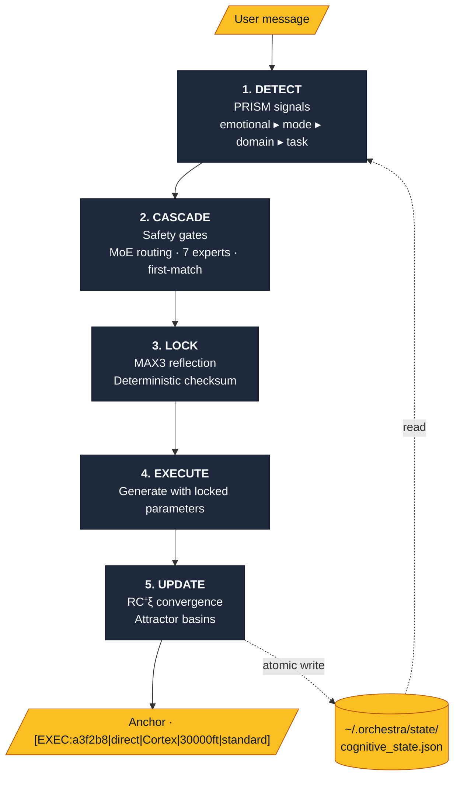
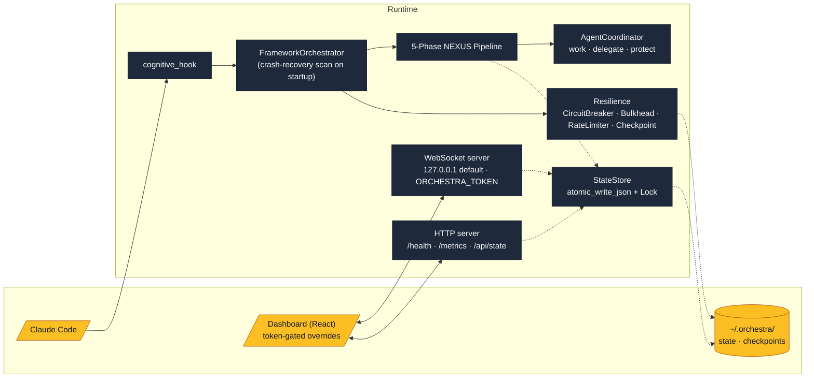

<p align="center">
  
</p>

<p align="center">
  <a href="CHANGELOG.md"></a>
  <a href="tests/"></a>
  <a href="https://python.org"></a>
  <a href="https://opensource.org/licenses/MIT"></a>
</p>

<p align="center"><strong>Cognitive safety layer for AI-assisted development</strong></p>

<p align="center"><em>Deterministic behavior. Burnout protection. Built for neurodivergent brains.</em></p>

<p align="center"><code>Same signals → Same routing → Same behavior</code></p>

---

## Why Orchestra?

You know the pattern:

> **Hyperfocus → ship fast → crash hard → forget where you were → start over**

AI-assisted development makes this worse. You build at the speed of thought—until you can't think anymore. The AI doesn't know you're running on empty. It keeps generating, you keep accepting, and then you hit the wall.

**Orchestra is the guardrail you can't build for yourself.**

It sits between you and the AI, tracking what you can't track in the moment: your energy, your momentum, your approaching burnout. It adapts the AI's behavior to your actual capacity—not the capacity you wish you had.

| What you're experiencing | What Orchestra does |
|--------------------------|---------------------|
| Depleted but pushing through | Blocks deep analysis, offers easy wins |
| Frustrated and spiraling | Empathy first, solutions second |
| Lost the thread | Resurfaces your goal and context |
| Hyperfocused for hours | Gentle checkpoint: "still good?" |
| In flow, shipping fast | Disappears. Stays out of your way. |

**This isn't productivity software. It's cognitive sustainability.**

### What's Novel

Most tools optimize for *output*. Orchestra optimizes for *sustainable output*.

- **Your state overrides your requests.** Ask for deep analysis while depleted? You get minimal. Safety gating isn't optional.

- **Emotional signals outrank task signals.** Frustrated + exploring = empathy first. The routing priority is fixed: human needs before task completion.

- **Behavior is deterministic.** Same input, same routing, every time. No more "why is the AI different today?" The uncertainty tax is gone.

- **Memory is external.** Sessions persist. Context survives. You pick up where you left off, not where you vaguely remember being.

*Built for brains that burn bright and need structure to fly.*

---

## Quick Start

### Install

```bash
pip install -e .
```

### Integrate with Claude Code

```bash
orchestra install-hook
# Restart Claude Code
```

That's it. Every message now passes through the cognitive engine.

---

## What It Does

Every message you send to Claude Code traverses the **5-Phase NEXUS Pipeline**.
Slate nodes are the core machinery; amber nodes are the boundaries — what
flows in, what flows out, and what's persisted.



Same signals → same routing → same checksum, every time.

---

## Expert Routing (Cognitive Safety MoE)

Signals are routed to intervention experts in **fixed priority** order:

| Priority | Expert | Triggers | Response |
|----------|--------|----------|----------|
| 1 | **Validator** | frustrated, RED, caps | Empathy first, normalize |
| 2 | **Scaffolder** | overwhelmed, stuck | Break down, reduce scope |
| 3 | **Restorer** | depleted, ORANGE | Easy wins, rest is OK |
| 4 | **Refocuser** | tangent, distracted | Gentle redirect |
| 5 | **Celebrator** | task_complete | Acknowledge win |
| 6 | **Socratic** | exploring, what_if | Guide discovery |
| 7 | **Direct** | focused, flow | Minimal friction |

**First match wins.** If you're frustrated AND exploring, Validator (priority 1) takes precedence.

---

## Safety Gating

The system protects you from yourself:

| State | Max Thinking Depth |
|-------|-------------------|
| `energy=depleted` | minimal |
| `energy=low` | standard |
| `burnout>=ORANGE` | standard |
| `burnout=RED` | minimal |
| `energy=high` | ultradeep (if requested) |

**Rule:** Safety state ALWAYS overrides user requests. Can reduce depth, never increase.

---

## CLI Commands

```bash
# Dashboard
orchestra                    # Launch TUI dashboard
orchestra status             # Show cognitive status
orchestra status --short     # Minimal status line

# State management
orchestra set -b YELLOW      # Set burnout level
orchestra set -e low         # Set energy level

# Hook management
orchestra install-hook       # Install Claude Code integration
orchestra uninstall-hook     # Remove integration

# Shell integration
orchestra init bash          # Get bash prompt config
orchestra init zsh           # Get zsh prompt config
```

---

## Session Management

Sessions auto-reset after 2 hours of inactivity:

- **Resets:** exchange counts, session timing, momentum, tangent budget
- **Preserves:** focus_level, urgency, energy_level (user preferences)
- **Clears burnout:** If you were ORANGE/RED, you start fresh at GREEN

---

## State Location

All state lives in `~/.orchestra/`:

```
~/.orchestra/
├── state/
│   └── cognitive_state.json    # 37 fields, all 5 phases
└── config/
    └── orchestra.json          # User preferences (future)
```

---

## Determinism Guarantees

ThinkingMachines [He2025] compliance:

- **FIXED** evaluation order (5 phases, no reordering)
- **FIXED** signal priority (emotional > mode > domain > task)
- **FIXED** expert priority (Validator > Scaffolder > ... > Direct)
- **LOCKED** parameters before generation
- **REPRODUCIBLE** checksums (same input → same checksum)

---

## For Developers

### Testing

```bash
pytest tests/test_cognitive_engine.py -v
```

### Direct API Usage

```python
from orchestra import create_orchestrator

orchestrator = create_orchestrator()
result = orchestrator.process_message("help me implement this feature")

print(result.to_anchor())  # [EXEC:a3f2b8|direct|Cortex|30000ft|standard]
print(result.routing.expert)  # Expert.DIRECT
print(result.convergence.epistemic_tension)  # 0.05
```

### Hook Testing

```bash
echo '{"user_prompt": "test"}' | python -m orchestra.hooks
```

---

## Architecture

Same two-tone palette: slate for the runtime, amber for everything that
sits at a trust boundary or persists to disk. The dashed lines are the
persistence edges — every byte of state goes through a single
`StateStore` (atomic writes + lock); transports never touch the file
directly.



```
Orchestra/
├── src/orchestra/
│   ├── cognitive_orchestrator.py  # 5-Phase NEXUS Pipeline
│   ├── expert_router.py           # Cognitive Safety MoE (7 experts)
│   ├── parameter_locker.py        # MAX3 + safety gating
│   ├── convergence_tracker.py     # RC^+xi tracking
│   ├── prism_detector.py          # Signal detection
│   ├── cognitive_state.py         # State management
│   ├── state_store.py             # Single owner of state file (atomic + lock)
│   ├── dashboard_bridge.py        # WebSocket sync
│   ├── websocket_server.py        # Real-time dashboard (token-gated overrides)
│   ├── http_server.py             # /health · /metrics · /api/state
│   ├── checkpoint.py              # Crash recovery (wired into orchestrator startup)
│   ├── hooks/
│   │   └── cognitive_hook.py      # Claude Code hook
│   └── cli/
│       └── main.py                # CLI entry point
├── tests/                         # 806 tests (100% pass)
│   ├── test_cognitive_engine.py   # Core orchestration
│   ├── test_parameter_locker.py   # Safety gating
│   ├── test_state_store.py        # Atomic persistence
│   ├── test_websocket_security.py # Token auth · override allowlist
│   ├── test_crash_recovery_wireup.py
│   ├── test_otel_adapter.py       # Observability
│   └── ...                        # Integration, chaos, resilience
└── pyproject.toml                 # v5.0.1
```

---

## Hardening

Recent first-principles review closed four classes of defect:

- **Loopback by default.** HTTP and WebSocket servers bind `127.0.0.1`
  unless the operator opts in. State-mutating WebSocket commands
  require a shared secret (`ORCHESTRA_TOKEN`) compared with
  `hmac.compare_digest`; without a token, every override is rejected.
- **Typed allowlist replaces `setattr` injection.** The override path
  consults a Pydantic `TypeAdapter` per field in `strict=True` mode —
  no coercion, no `hasattr` fallback. 35 fields in scope; oversized
  strings/lists, out-of-range numerics, and unknown attributes are all
  rejected.
- **Single `StateStore` for `cognitive_state.json`.** Atomic
  write-then-rename via `file_ops.atomic_write_json`, threaded lock,
  cached load. Three previous writers (WS, HTTP, cognitive_state)
  collapse to one consumer surface.
- **Crash recovery is now actually called.** `recover_from_crash()`
  was exported but never invoked; `FrameworkOrchestrator.__init__` now
  scans for interrupted orchestrations on startup, logs each one, and
  exposes them as `self.startup_interrupted` for metrics.

---

## Philosophy

Orchestra is built for neurodivergent brains:

1. **Safety first** - Emotional safety before productivity
2. **Ship over perfect** - Working beats polished
3. **Protect momentum** - Don't break flow unnecessarily
4. **External memory** - Write it down, don't hold it in your head
5. **Recover without guilt** - Rest is productive

---

## Documentation

| Document | Description |
|----------|-------------|
| [CHANGELOG](CHANGELOG.md) | Version history and release notes |
| [QUICKSTART](docs/QUICKSTART.md) | 2-minute setup guide |
| [ARCHITECTURE](docs/ARCHITECTURE.md) | Technical deep-dive |
| [CONTRIBUTING](CONTRIBUTING.md) | Development guidelines |
| [CITATIONS](CITATIONS.md) | Academic references |

---

## Installation

```bash
# From PyPI
pip install cognitive-orchestra

# From source
git clone https://github.com/JosephOIbrahim/Orchestra.git
cd Orchestra
pip install -e .
```

---

## Credits

- [USD](https://graphics.pixar.com/usd/) composition semantics for cognitive state
- [ThinkingMachines](https://thinkingmachines.ai/blog/defeating-nondeterminism-in-llm-inference/) [He2025] for batch-invariance

---

## License

MIT License - see [LICENSE](LICENSE) for details.

---

*Orchestra v5.0.1 - Cognitive Engine for Claude Code*

[](https://pypi.org/project/cognitive-orchestra/)
[](https://opensource.org/licenses/MIT)
