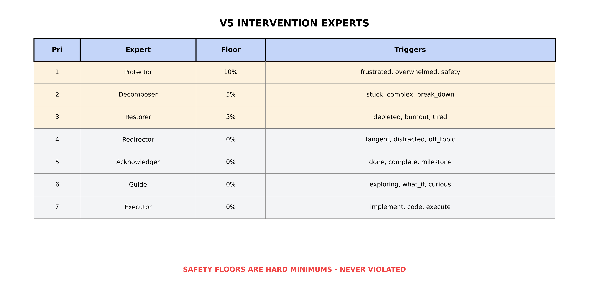

# Agents

## Overview

Framework Orchestrator uses 7 specialized agents, each implementing a specific cognitive framework. All agents share a common interface through `BaseAgent`.

## Agent Interface

```python
class BaseAgent(ABC):
    def __init__(self, name: str, framework: str, ces_alignment: str):
        self.name = name
        self.framework = framework
        self.ces_alignment = ces_alignment

    @abstractmethod
    async def execute(self, task: str, context: Dict[str, Any]) -> Dict[str, Any]:
        """Execute the agent's task."""
        pass
```

## The 7 Agents

### 1. ECHO Curator

**Framework**: ECHO 2.0 + LIVRPS
**Purpose**: Memory management with USD composition semantics

The ECHO Curator manages memory using LIVRPS priority resolution:

```
L - LOCAL        (session state, compresses first)
I - INHERITS     (parent context)
V - VARIANTSETS  (memory modes)
R - REFERENCES   (calibration)
P - PAYLOADS     (domain knowledge)
S - SPECIALIZES  (principles, NEVER compressed)
```

**Key Features**:
- Principles layer is protected and NEVER compressed
- Memory modes: focused_recall, exploratory_recall, recovery_recall
- Compression follows strict order (LOCAL → INHERITS → PAYLOADS)

**Output Example**:
```json
{
  "memory_architecture": "LIVRPS",
  "active_mode": "focused_recall",
  "resolution": {
    "query": "Find error handling pattern",
    "resolved_from": "local",
    "principles_consulted": false
  },
  "compression_state": {
    "total_memory_items": 15,
    "protected_layers": ["specializes", "references", "variantsets"]
  }
}
```

---

### 2. Domain Intelligence

**Framework**: Phoenix v6 + PRISM
**Purpose**: Multi-domain analysis with pluggable specialists

Routes tasks to domain-specific specialists based on keyword matching.

**Domain Loading**:
```
~/.framework-orchestrator/domains/
├── <your_domain>.json  # User-defined domain specialists
└── general.json        # Fallback specialists (auto-created if missing)
```

Domains are loaded dynamically. Users add domain configs as needed for their workflows.

**Key Features**:
- Dynamic domain loading from JSON configs
- Multi-domain detection (can match multiple domains)
- PRISM 6-perspective analysis
- Specialist routing within domains

**Output Example**:
```json
{
  "detected_domains": ["my_domain"],
  "primary_domain": "my_domain",
  "detected_specialists": ["my_domain.analysis", "my_domain.optimization"],
  "primary_specialist": "my_domain.analysis",
  "prism_perspectives_applied": ["causal", "optimization", "risk"],
  "domain_task_detected": true
}
```

---

### 3. MoE Router (V5 Intervention Experts)

**Framework**: V5 Intervention Experts with Safety Floors
**Purpose**: 5-phase deterministic expert routing with safety guarantees

Routes tasks to intervention experts using a 5-phase process with enforced safety floors.

**V5 Expert Archetypes** (ordered by priority):

| Priority | Expert | Purpose | Safety Floor | Triggers |
|----------|--------|---------|--------------|----------|
| 1 | **Protector** | Safety-first, empathy | 10% (HARD) | frustrated, overwhelmed, safety, caps, help |
| 2 | **Decomposer** | Break down complexity | 5% (HARD) | stuck, complex, too_many, break_down, simplify |
| 3 | **Restorer** | Recovery facilitation | 5% (HARD) | depleted, burnout, tired, rest, exhausted |
| 4 | **Redirector** | Attention management | 0% | tangent, distracted, off_topic, sidetrack |
| 5 | **Acknowledger** | Progress recognition | 0% | done, complete, milestone, win, finished |
| 6 | **Guide** | Discovery facilitation | 0% | exploring, what_if, curious, learn, understand |
| 7 | **Executor** | Direct task execution | 0% | implement, code, do, execute, build, create |



*Figure: V5 expert configuration showing priority order, safety floors, and trigger patterns. Safety-critical experts (Protector, Decomposer, Restorer) maintain hard minimum floors that cannot be violated.*

**5-Phase Routing**:
1. **ACTIVATE** - Signal detection → activation vector (trigger matching)
2. **WEIGHT** - Apply expert weights (from Mycelium learning)
3. **BOUND** - Enforce safety floors + homeostatic normalization
4. **SELECT** - argmax with priority tiebreaker
5. **UPDATE** - Prepare context for Hebbian learning

**Key Constraints**:
- Safety floors are **HARD minimums** - Protector never drops below 10%
- Bounded scores always sum to 1.0 (homeostatic regulation)
- Priority-based tiebreaking (lower priority number wins ties)

**Output Example**:
```json
{
  "routing_version": "v5",
  "routing_type": "v5_5phase",
  "routing_phases": ["activate", "weight", "bound", "select", "update"],
  "selected_expert": "executor",
  "expert_hash": "a7b3c2d1e5f6",
  "activation_vector": {
    "protector": 0.0,
    "decomposer": 0.0,
    "executor": 0.6
  },
  "bounded_scores": {
    "protector": 0.10,
    "decomposer": 0.05,
    "restorer": 0.05,
    "executor": 0.80
  },
  "safety_floors_applied": true,
  "protector_floor_met": true
}
```

**Mycelium Integration**:
The MoE Router can receive learned weights from the Mycelium neuroplasticity mechanism via `context["mycelium_weights"]`. This enables adaptive expert selection based on task outcome history.

**Framework Lineage**:

| V5 Component | Source Framework | Reference |
|--------------|-----------------|-----------|
| 7 Expert Archetypes | ADHD Support Framework | Validator, Scaffolder, Restorer, Refocuser, Celebrator, Socratic, Direct |
| Safety Floors | ADHD Support + ECHO 2.0 | Burnout detection, constitutional field |
| 5-Phase Routing | NEXUS Framework | DETECT→CASCADE→LOCK→EXECUTE→UPDATE |
| Hebbian Learning | Cortex_Mycelium Framework | Local connection strengthening, homeostatic plasticity |
| Convergence Tracking | RC^+xi Framework | Epistemic tension: xi_n = \|\|A_{n+1} - A_n\|\|_2 |
| Batch-Invariance | ThinkingMachines [He2025] | Fixed iteration order, no dynamic switching |

See `V5_FRAMEWORK_SYNTHESIS.md` for detailed mappings.

---

### 4. World Modeler

**Framework**: Cortex v3 (Hierarchical)
**Purpose**: Context graph construction

Builds a dependency graph of the task context.

**Key Features**:
- Entity extraction
- Dependency mapping
- Hierarchical context structure
- Paradigm selection (Cortex vs Mycelium)

**Output Example**:
```json
{
  "entities_extracted": ["task_config", "system_settings", "output_path"],
  "dependency_graph": {
    "task_config": ["system_settings"],
    "system_settings": ["output_path"]
  },
  "active_paradigm": "cortex_hierarchical",
  "context_tokens": 2048
}
```

---

### 5. Code Generator

**Framework**: NEXUS Execution
**Purpose**: Deterministic code generation

Generates code with locked parameters for reproducibility.

**Key Features**:
- 5-phase execution (DETECT → CASCADE → LOCK → EXECUTE → UPDATE)
- Locked generation parameters
- Execution checksums

**Output Example**:
```json
{
  "execution_phases": ["detect", "cascade", "lock", "execute", "update"],
  "generation_params": {
    "temperature": 0.7,
    "max_tokens": 4096,
    "deterministic": true
  },
  "output_type": "code_snippet",
  "execution_checksum": "d4e5f6a7b8c9"
}
```

---

### 6. Determinism Guard

**Framework**: ThinkingMachines Batch Invariance
**Purpose**: Enforce reproducibility constraints

Validates determinism requirements before execution.

**Critical Settings**:
```python
batch_size = 1           # The key fix
cudnn.benchmark = False
cudnn.deterministic = True
```

**Key Features**:
- Batch size validation
- CUDA determinism checks
- Seed propagation verification
- Checksum validation

**Output Example**:
```json
{
  "determinism_status": "enforced",
  "batch_size_check": {
    "required": 1,
    "current": 1,
    "compliant": true
  },
  "cuda_settings": {
    "cudnn_benchmark": false,
    "cudnn_deterministic": true
  },
  "seed_propagation": "verified",
  "recommendations": []
}
```

---

### 7. Self Reflector

**Framework**: RC^+xi (Resonance + Convergence)
**Purpose**: Meta-cognition and convergence tracking

Monitors epistemic tension and checks for goal drift.

**Convergence Formula**:
```
xi_n = ||A_{n+1} - A_n||_2  (epistemic tension)
Converged when xi_n < epsilon (0.1) for 3 consecutive exchanges
```

**Key Features**:
- Epistemic tension calculation
- Constitutional compliance check
- Goal drift detection
- Attractor basin analysis

**Output Example**:
```json
{
  "reflection_type": "convergence_check",
  "epistemic_tension": {
    "xi_n": 0.15,
    "epsilon": 0.1,
    "trend": "decreasing"
  },
  "constitutional_compliance": {
    "principles_checked": 7,
    "violations": []
  },
  "attractor_analysis": {
    "current_attractor": "focused",
    "stability": 0.85
  },
  "recommendation": "Continue current approach"
}
```

## Agent Activation

Not all agents run for every task. The orchestrator activates agents based on task analysis:

| Condition | Always Active | Conditionally Active |
|-----------|---------------|---------------------|
| Any task | echo_curator, determinism_guard | - |
| Domain keywords | - | domain_intelligence |
| Complex context | - | world_modeler |
| Code generation | - | code_generator, moe_router |
| Long session | - | self_reflector |

## Supporting Classes

### Mycelium (Neuroplasticity Mechanism)

The `Mycelium` class provides a foundation for adaptive learning across sessions:

**Purpose**: Hebbian learning for expert weight adaptation

**Key Features**:
- Records task outcomes for each expert selection
- Provides weights to MoE Router via context
- Foundation for future temporal aggregation and attractor dynamics

**Current Implementation** (v5 Foundation):
```python
from framework_orchestrator import Mycelium

mycelium = Mycelium()

# Get current weights for routing
weights = mycelium.get_weights()
result = await moe_router.execute(task, {"mycelium_weights": weights})

# Record outcome after task completion
mycelium.record_outcome(
    expert="executor",
    outcome=1.0,  # 0.0 = failure, 1.0 = success
    task_hash="abc123"
)

# Inspect state
state = mycelium.get_state()
# Returns: weights, learning_rate, outcomes_recorded, recent_outcomes
```

**Future Work**:
- Full Hebbian update: `w_new = w_old + α(outcome - expected) × activation`
- Temporal aggregation across sessions (persistence)
- Attractor dynamics for stable expert preferences
- Homeostatic regulation to prevent runaway specialization

---

## Adding Custom Agents

1. Extend `BaseAgent`:
```python
class MyAgent(BaseAgent):
    def __init__(self):
        super().__init__(
            name="my_agent",
            framework="My Framework",
            ces_alignment="What it does"
        )

    async def execute(self, task: str, context: Dict) -> Dict:
        # Your logic here
        return {
            "output": "result",
            "my_field": "value"
        }
```

2. Register in orchestrator:
```python
self.agents["my_agent"] = MyAgent()
```

3. Add activation logic in `_route_task()`:
```python
if "my_keyword" in task_lower:
    active.append("my_agent")
```

---

## References

- [He2025] He, Horace and Thinking Machines Lab. (2025). "Defeating Nondeterminism in LLM Inference." *Thinking Machines Lab: Connectionism*, September 2025. https://thinkingmachines.ai/blog/defeating-nondeterminism-in-llm-inference/
